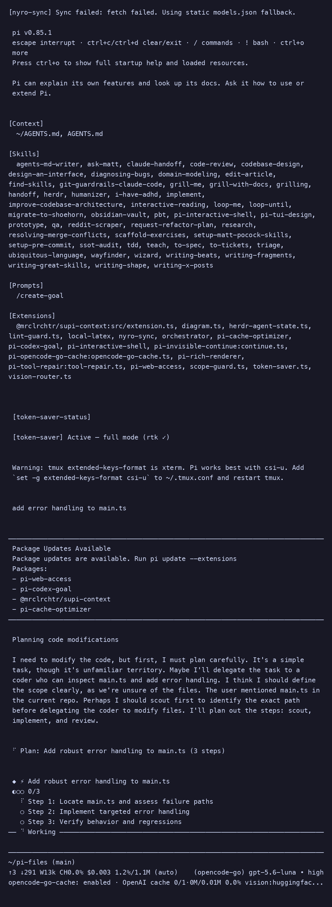
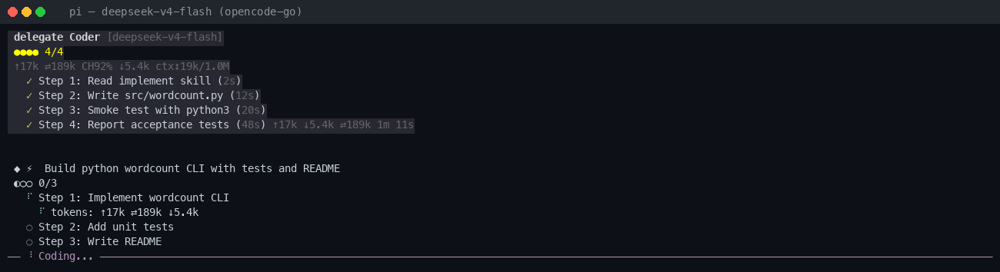
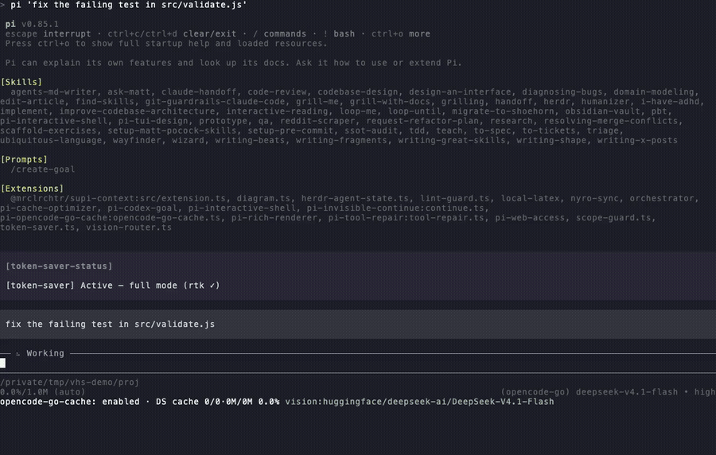

# pi-files

**A set of extensions for the [pi](https://github.com/earendil-works/pi) coding agent. The flagship is an orchestrator that turns one agent into a team — it plans, delegates to specialist subagents, and verifies the result.**




> Real terminal screenshots of pi running the orchestrator.

## What it does

The orchestrator holds the big picture and delegates the work. A single task becomes a team:

```
orchestrator (plans, decides, verifies)
   ├─ scout      → reads and maps code      (read-only)
   ├─ coder      → writes and edits         (read + write)
   ├─ reviewer   → verifies the change      (read-only + bash)
   ├─ researcher → searches docs and web
   └─ writer     → writes documentation
```

Each specialist is a focused profession with its own tools, skills, and guardrails. The orchestrator never reads source files directly — scouts return short findings, the orchestrator decides, coders do the reading and editing. This keeps the expensive model's context clean and pushes the token-heavy work onto cheap models.

It scales the orchestration to the task: trivial tasks run as a single coder; harder ones escalate. A hard exploration budget forces escalation when a worker starts floundering, so it can't quietly burn minutes going nowhere.



*A real run: the plan panel sets 3 steps, a Scout delegation investigates, a Coder fixes the bug, and tests are reported passing.*

## Extensions

| Extension | What problem it solves |
|-----------|------------------------|
| **[orchestrator](extensions/orchestrator/README.md)** | One prompt becomes a team. Plans, delegates to 5 specialists, verifies |
| **[token-saver](extensions/token-saver.README.md)** | Cuts token cost on raw tool output, cache-safe |
| **[lint-guard](extensions/lint-guard.README.md)** | Every edit is auto-linted — 14 linters, 7 languages, no config |
| **[scope-guard](extensions/scope-guard.README.md)** | A subagent physically can't write outside its approved scope |
| **[vision-router](extensions/vision-router.README.md)** | Image questions land on a vision-capable model automatically |
| **[local-latex](extensions/local-latex/README.md)** | Renders `.tex` to PDF locally, no cloud |
| **[diagram](extensions/diagram.README.md)** | One line of matplotlib becomes an image |
| **[herdr-agent-state](extensions/herdr-agent-state.README.md)** | Shares agent state across herdr panes (managed by herdr) |

Each extension has its own README.

## The idea behind it

pi gives you one agent and a context window. `pi-files` makes it work like a team:

- **Cheap models do the work, expensive models decide.** Scouting and editing burn tokens on cheap models; the orchestrator holds only decisions. Reading a file in a cheap subagent costs pennies; holding it in the expensive orchestrator costs dollars and degrades every later decision.
- **Guards, not vibes.** `lint-guard` and `scope-guard` are deterministic — no LLM — so they are free and cannot hallucinate.
- **Fusion for hard calls.** `fusion()` runs a panel of models and a judge to critique a plan before expensive work begins.

## How it compares

How each project documents the capabilities below, as of this reading. "—" means the project does not document that capability; "not documented" means we checked and found no mention.

| Capability | pi-files (this) | nicobailon/pi-subagents | tintinweb/pi-subagents | vanilla pi |
|-----------|-----------------|-------------------------|------------------------|------------|
| Scope enforcement | Tool-level, fail-closed | not documented | not documented | none |
| Orchestrator reads files | blocked; must delegate | — | — | full access |
| Deterministic guards | lint-guard + scope-guard, no LLM | — | — | — |
| Difficulty-driven escalation | yes | — | — | — |
| Per-delegation tokens/cost | shown per delegation | — | display only | totals only |
| Published with/without benchmark | no (not yet) | no | no | n/a |

No head-to-head benchmark has been run, so this table is about documented capabilities, not measured performance.

## Evidence

- **1243 tests passing** across 81 files, plus a clean typecheck.
- **TUI smoke test: 9/9 checks** (plan panel, activity feed, specialist blocks, no crashes).
- **8 extensions**, each with its own focused README.

## Quick start

```bash
pi install git:github.com/shivam2014/pi-files
pi list          # verify
pi remove git:github.com/shivam2014/pi-files
```

## Documentation

- [`docs/`](docs/) — specs and design notes
- [`extensions/orchestrator/`](extensions/orchestrator/README.md) — the orchestrator (own README and docs)

## License

MIT
